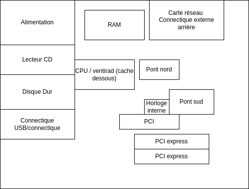

### Helec Bastien - TP1 
---
## TP2 Audit Hardware 

2. A l'aide des commandes linux vue dans le dernier TP, dessinez sur une feuille A4 l'architecture de votre PC. Votre diagramme devra montrer les principaux composants , bus et sous bus 

<!--ajout image -->


le role de l'alimentation est de fournir de l'énergie aux composants de l'ordinateur. 

Le role de la RAM permet de stocker des données temporairement.

La carte réseau permet de communiquer avec d'autres ordinateurs.

Les connectiques exterieur permettent de connecter des périphériques à l'ordinateur.

Le CPU est le coeur de l'ordinateur, il permet de traiter les données.

Le ventirad permet de refroidir le CPU.

Le lecteur CD permet de lire des CD.

Le disque dur permet de stocker des données de manière permanente.

Les bus PCI et PCI express permettent de connecter des périphériques à l'ordinateur.

Le pont nord permet de permet de relier les connecteurs internes au cpu 

Le pont sud permet de connecter le CPU au bus PCI express.

3. Documentez vous sur les commandes et fichiers indiqués dans le diagramme ci-dessous.
Selectionnez celles concernant le materiel uniquement. et expliquez les.

```lspci ```
permet d'afficher les périphériques PCI


```lsblk```
permet d'afficher les périphériques de stockage

```lsscsi``` 
permet d'afficher les périphériques SCSI


```block dev``` permet d'afficher les périphériques de stockage

```smartctl```
permet de faire des tests automatiques sur les disques durs

```swapon```
permet d'afficher les périphériques de stockage

```storecli```
permet l'adminisftration des contrôleurs de stockage

```MegaCli```
permet l'administration des contrôleurs de stockage 

```ioostat```
permet d'afficher les statistiques d'entrée/sortie 

```iotop```
permet d'afficher les statistiques d'entrée/sortie 

```lsusb```
permet d'afficher les périphériques USB 

```blktrace```
suit les entrées sorties de la couche bloc

```lscpu```
permet d'afficher les informations du CPU 

```cpuid```
permet  de liste les id du CPU

```/proc/cpuinfo```
affiche les informations du CPU

```turbostat```
affiche les statistiques de turbo boost (cpu , frequence, température ...)

```tiptop```
affiche les performances materielles

```perf```
analyse les performances des materielles

```llcstat```
affiche les statistique statique du compileur de la LLVM

```profile```
enregistre les statistiques de performance

```numastat```
affiche les statistiques de la mémoire

```lstopo```
affiche l'architecture du CPU

```numactl```
controle les NUMA policy pour les processus ou les memoires partages 

```mpstat```
affiche les statistiques du CPU

```powertop```
affiche les statistiques de consommation d'énergie

```/proc/stat```
affiche les statistiques du CPU

```top```
affiche les proccessus linux  

```htop```
vue processus interactif 

```ps```
présenter un cliché instantané des processus actifs

```pidstat```
affiche les statistiques des taches

```sar```
collectes , renvoie et analyse les informations du système

```ipmitool```
permet de communiquer avec le matériel de gestion de l'ordinateur

```dmidecode```
table de description de l'infrastructure matériel

```lshw```
liste les composants du matériel

```/sys```
affiche les informations du matériel

```dmesg```
affiche et controle le tampon circulaire du noyau

```sysctl```
configure les paramètres du noyau

```journalctl```
affiche le journal matériel 

```lsmod```
affiche les modules du noyau
