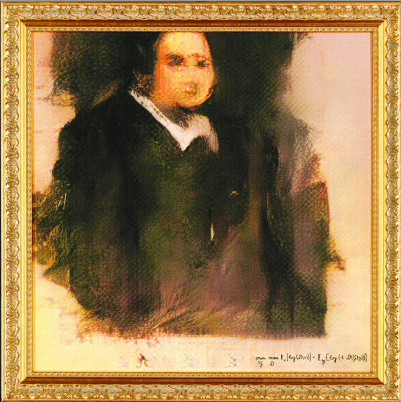
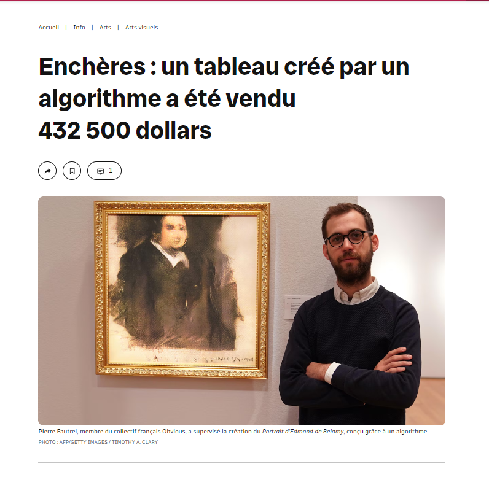
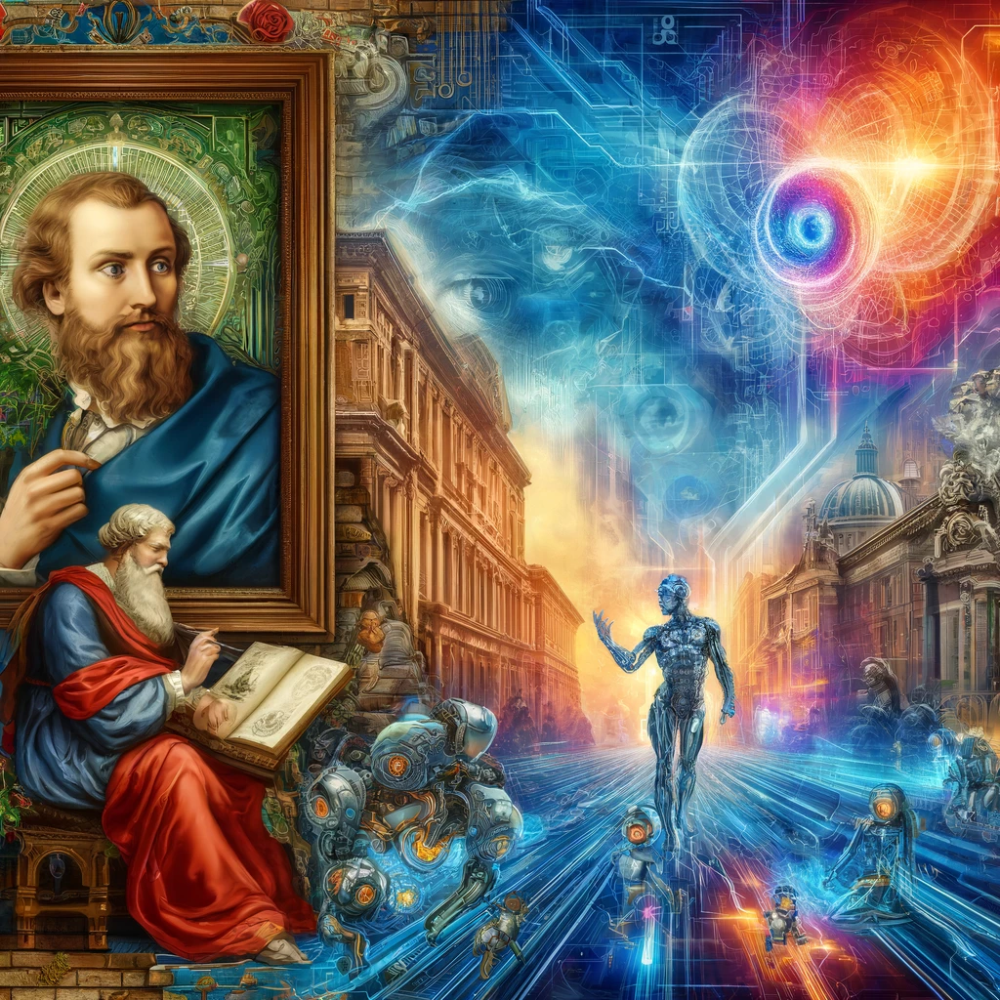

# Titre: L'Intelligence Artificielle et l'Art : Collaboration ou Confrontation ?
## Introduction

Depuis des millénaires, l'art se manifeste sous diverses formes, chaque culture et époque offrant ses propres expressions artistiques, de la peinture et la sculpture aux performances numériques et à l'installation multimédia. Aujourd'hui, une nouvelle révolution est à l'horizon avec l'intégration de l'intelligence artificielle, une technologie offrant des perspectives fascinantes mais également des défis sans précédent.

*For millennia, art has manifested itself in diverse forms, with each culture and era offering its own artistic expressions, from painting and sculpture to digital performance and multimedia installation. Today, a new revolution is on the horizon with the integration of artificial intelligence, a technology offering fascinating prospects but also unprecedented challenges.*

## Développement
### Qu'est-ce que l'IA?

L'intelligence artificielle désigne les systèmes ou machines qui imitent l'intelligence humaine pour effectuer des tâches et peuvent s'améliorer en se basant sur les informations collectées. L'IA englobe plusieurs domaines d'application, depuis la reconnaissance vocale jusqu'au traitement automatique du langage naturel.

*Artificial intelligence refers to systems or machines that mimic human intelligence to perform tasks, and can improve themselves based on the information they gather. AI encompasses many fields of application, from speech recognition to the automatic processing of natural language.*

### L'IA dans le monde
L'impact de l'IA sur la société moderne est indéniable, influençant des secteurs aussi variés que la santé, la finance, l'industrie et maintenant l'art. L'adoption de l'IA dans ces domaines soulève des questions éthiques, sociales et économiques cruciales.

*The impact of AI on modern society is undeniable, influencing sectors as diverse as healthcare, finance, industry and now art. The adoption of AI in these fields raises crucial ethical, social and economic questions.*

### L'IA dans l'art
Dans le domaine artistique, l'IA ouvre de nouvelles avenues pour la création. Les artistes utilisent l'IA pour expérimenter avec de nouveaux styles et techniques, créant des œuvres qui étaient auparavant impensables. En art visuel, l'IA a la capacité d'analyser des milliers d'œuvres d'art pour créer des motifs uniques, ou même de générer des œuvres d'art autonomes.

*In the field of art, AI is opening up new avenues for creation. Artists are using AI to experiment with new styles and techniques, creating works that were previously unthinkable. In visual art, AI has the ability to analyze thousands of works of art to create unique patterns, or even to generate autonomous works of art.*

### Exemple : "Edmond de Belamy"

Par exemple, l'œuvre intitulée "Edmond de Belamy" issue de la série "La Famille de Belamy", une série de portraits fictifs créée par le collectif d'artistes français Obvious, a été créée par leur algorithme GAN (Generative Adversarial Network). Cette œuvre, générée entièrement par une IA sans intervention directe humaine dans le processus créatif, présente un portrait fictif qui ressemble à des portraits classiques, mais avec des traits et des détails légèrement distordus, illustrant la capacité unique de l'IA à créer des œuvres visuelles autonomes.

*For example, the work entitled "Edmond de Belamy" from the series "La Famille de Belamy", a series of fictional portraits created by French artist collective Obvious, was created by their GAN (Generative Adversarial Network) algorithm. This work, generated entirely by AI without direct human intervention in the creative process, features a fictional portrait that resembles classic portraits, but with slightly distorted features and details, illustrating AI's unique ability to create autonomous visual works.*

### Exemple : "Edmond de Belamy"

Pour générer le portrait "Edmond de Belamy", l'IA a été inspirée par un ensemble de 15 000 portraits peints entre le 14e et le 20e siècle et apprend à partir de ces exemples pour générer des œuvres originales. Cet entraînement permet à l'IA de synthétiser des caractéristiques artistiques traditionnelles dans de nouvelles compositions, aboutissant à des œuvres comme "Edmond de Belamy", qui a été vendue aux enchères pour 432 500 dollars.

*To generate the portrait "Edmond de Belamy", the AI was inspired by a collection of 15,000 portraits painted between the 14th and 20th centuries, and learns from these examples to generate original works. This training enables the AI to synthesize traditional artistic features into new compositions, resulting in works like "Edmond de Belamy", which sold at auction for $432,500.*

### Impact de l'IA sur l'art visuel
Comme nous l'avons vu, l'IA en art visuel peut être vue comme un outil qui augmente les capacités créatives des artistes, leur permettant d'explorer des complexités et des abstractions nouvelles. Cependant, cette technologie soulève aussi des questions éthiques, notamment concernant l'originalité et la paternité des œuvres générées par IA.

*As we have seen, AI in visual art can be seen as a tool that enhances artists' creative capacities, enabling them to explore new complexities and abstractions. However, this technology also raises ethical questions, notably concerning the originality and authorship of AI-generated works.*

### Avantages

- Innovation : L'IA peut combiner styles et techniques de manière inédite, poussant les frontières de l'art traditionnel (Edmond de Belamy)
- Accessibilité : Des outils basés sur l'IA peuvent rendre la création artistique plus accessible aux non-artistes, démocratisant ainsi le processus créatif.

*Innovation: AI can combine styles and techniques in unprecedented ways, pushing back the boundaries of traditional art (Edmond de Belamy)
Accessibility: AI-based tools can make artistic creation more accessible to non-artists, democratizing the creative process.*

### Inconvénients (même diapo que celle d'avant)

- Authenticité : La question de savoir si une œuvre créée avec l'aide de l'IA peut être considérée comme authentiquement "artistique" demeure controversée.
- Dépendance technologique : Une forte dépendance à la technologie peut éroder les compétences traditionnelles et la valeur personnelle de l'art.

*Authenticity: The question of whether a work created with the help of AI can be considered authentically "artistic" remains controversial.
Technological dependence: Heavy reliance on technology can erode traditional skills and the personal value of art.*

### Démonstration

Pour saisir pleinement l'impact potentiel de l'intelligence artificielle sur l'art, il faut comprendre que l'IA ne se contente pas de reproduire des techniques existantes ; elle ouvre également des voies vers de nouvelles formes d'expression artistique qui étaient auparavant inexplorées ou impossibles à réaliser par des moyens traditionnels.

Considérons, par exemple, comment l'IA peut fusionner des éléments de différents mouvements artistiques pour créer quelque chose de totalement unique. En utilisant des modèles comme DALL-E, un outil avancé de création d'images basé sur le texte, l'IA peut comprendre et manipuler des éléments visuels de manière créative en analysant de vastes ensembles de données artistiques.

Pour illustrer ce point, nous avons préparé une démonstration utilisant DALL-E dans laquelle nous avons demandé à l'IA de créer une œuvre qui mélange les éléments de l'impressionnisme et du surréalisme avec une touche moderne. Le résultat, que vous verrez dans un instant, illustre la manière dont l'IA peut servir de catalyseur pour transcender les limitations traditionnelles de la création artistique et ouvrir la porte à de nouvelles formes d'expression.

*To fully grasp the potential impact of artificial intelligence on art, we need to understand that AI doesn't just reproduce existing techniques; it also opens up avenues to new forms of artistic expression that were previously unexplored or impossible to achieve by traditional means.
Consider, for example, how AI can fuse elements of different artistic movements to create something totally unique. Using models like DALL-E, an advanced text-based image creation tool, AI can understand and creatively manipulate visual elements by analyzing vast artistic datasets.
To illustrate this point, we've prepared a demonstration using DALL-E in which we asked the AI to create a work that blends elements of Impressionism and Surrealism with a modern twist. The result, which you'll see in a moment, illustrates how AI can act as a catalyst to transcend the traditional limitations of artistic creation and open the door to new forms of expression.*

